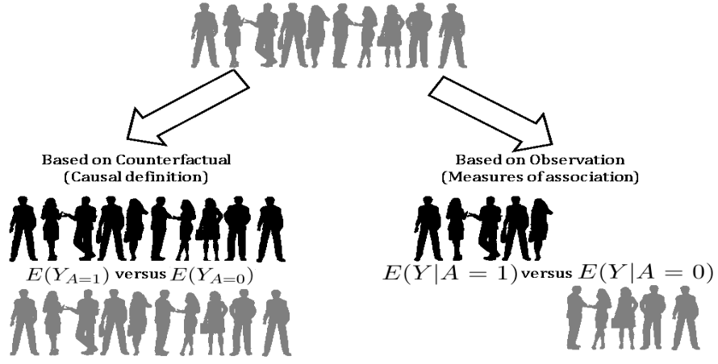

# G-computation

```{r setup01g, include=FALSE}
require(huxtable)
require(boot)
require(knitr)
require(glmnet)
require(kableExtra)
require(dplyr)
require(xgboost)
require(SuperLearner)
options(knitr.kable.NA = '')
cachex=TRUE
```


## Closer look at the data

```{r reg2r, cache=cachex, echo = TRUE}
# Read the data saved at the last chapter
ObsData <- readRDS(file = "data/rhcAnalytic.RDS")
dim(ObsData)
```

In this dataset, we have 

- `r prettyNum(dim(ObsData)[1],big.mark=",",scientific=FALSE)` subjects, 
- 1 outcome variable ($Y$ = length of stay), 
- 1 exposure variable ($A$ = RHC status), and 
- `r dim(ObsData)[2]-2` covariates.

### View data from 6 participants

```{block, type='rmdcomment'}
Let's focus on only first 6 columns, with only 3 variables.
```

```{r reg2rb, cache=cachex, echo = TRUE}
small.data <- ObsData[1:6,c("sex","A","Y")]
kable(small.data)
```

### New notations

|Notations| Example in RHC study|
|---|---|
|$A$: Exposure status  | RHC |  
|$Y$: Observed outcome  | length of stay  |  
|$Y(A=1)$ = potential outcome when exposed  | length of stay when RHC used  |  
|$Y(A=0)$ = potential outcome when not exposed  | length of stay when RHC not used  |  
|$L$: covariates  | $49$ covariates  |  

```{block, type='rmdcomment'}
For explaining the concepts in this chapter, we will convert our data representation 
```

- from

| Covariate | Exposure | Observed outcome |
|---|---|---|
| $L$ | $A$ | $Y$ |  
| sex | `RHC` | length of stay |

- to the following representation:

| Covariate | Exposure | Outcome under exposed | Outcome under unexposed |
|---|---|---|---|
| $L$ | $A$ | $Y(A=1)$ |$Y(A=0)$ |  
| sex | `RHC` | length of stay under `RHC`  | length of stay under `no RHC` | 

### Restructure the data to estimate treatment effect

In causal inference literature, often the data is structured in such a way that the outcomes $Y$ under different treatments $A$ are in different columns. What we are doing here is we are distinguishing $Y(A=1)$ from $Y(A=0)$.

```{r reg2rc, cache=cachex, echo = TRUE}
small.data$id <- c("John","Emma","Isabella","Sophia","Luke", "Mia")
small.data$Y1 <- ifelse(small.data$A==1, small.data$Y, NA)
small.data$Y0 <- ifelse(small.data$A==0, small.data$Y, NA)
small.data$TE <- small.data$Y1 - small.data$Y0
small.data <- small.data[c("id", "sex","A","Y1","Y0", "TE")]
small.data$Y <- NULL
small.data$sex <- as.character(small.data$sex)
m.Y1 <- mean(small.data$Y1, na.rm = TRUE)
m.Y0 <- mean(small.data$Y0, na.rm = TRUE)
mean.values <- round(c(NA,NA, NA, m.Y1, m.Y0,
                 m.Y1 - m.Y0),0)
small.data2 <- rbind(small.data, mean.values)
kable(small.data2, booktabs = TRUE, digits=1,
             col.names = c("Subject ID","Sex",
                           "RHC status (A)", 
                           "Y when A=1 (RHC)", 
                           "Y when A=0 (no RHC)", 
                           "Treatment Effect"))%>%
  row_spec(7, bold = TRUE, color = "white", 
           background = "#D7261E")
```

Then it is easy to see 

- the mean outcome under treated group (`RHC`)
- the mean outcome under untreated group (`no RHC`)

and the difference between these two means is the **treatment effect**.

### Treat the problem as a missing value problem

```{block, type='rmdcomment'}
Restructure the problem as a missing data problem.
```

Instead of just estimating treatment effect on an average level, an alternate could be to

- impute **mean outcomes for the treated subjects**
- impute **mean outcomes for the untreated subjects**
- Calculate individual treatment effect estimate
- then calculate the **average treatment effect**

```{r reg2rd, cache=cachex, echo = TRUE}
small.data0 <- small.data
small.data$Y1[is.na(small.data$Y1)] <- round(m.Y1)
small.data$Y0[is.na(small.data$Y0)] <- round(m.Y0)
small.data$TE <- small.data$Y1 - small.data$Y0
m.Y1 <- mean(small.data$Y1)
m.Y1
m.Y0 <- mean(small.data$Y0)
m.Y0
m.TE <- mean(small.data$TE)
mean.values <- round(c(NA,NA, NA, m.Y1, m.Y0, m.TE),0)
small.data2 <- rbind(small.data, mean.values)
small.data2$Y1[1:6] <- cell_spec(small.data2$Y1[1:6], 
                            color = ifelse(small.data2$Y1[1:6] 
                                           == round(m.Y1), 
                                           "red", "black"),
                            background = ifelse(small.data2$Y1[1:6] 
                                           == round(m.Y1), 
                                           "yellow", "white"),
                            bold = ifelse(small.data2$Y1[1:6] 
                                           == round(m.Y1), 
                                           TRUE, FALSE))
small.data2$Y0[1:6] <- cell_spec(small.data2$Y0[1:6], 
                            color = ifelse(small.data2$Y0[1:6] 
                                           == round(m.Y0), 
                                           "red", "black"),
                            background = ifelse(small.data2$Y0[1:6] 
                                           == round(m.Y0), 
                                           "yellow", "white"),
                            bold = ifelse(small.data2$Y0[1:6] 
                                           == round(m.Y0), 
                                           TRUE, FALSE))
kable(small.data2, booktabs = TRUE, 
      digits=1, escape = FALSE,
      col.names = c("Subject ID","Sex",
                           "RHC status (A)", 
                           "Y when A=1 (RHC)", 
                           "Y when A=0 (no RHC)", 
                           "Treatment Effect"))%>%
  row_spec(7, bold = TRUE, color = "white", 
           background = "#D7261E")
```

### Impute better value?

```{block, type='rmdcomment'}
Assume that `sex` variable is acting as a **confounder**. Then, it might make more sense to restrict imputing outcome values specific to **male** and **female** participants.
```

- impute **means specific to males for male subjects**, and separately 
- impute **means specific to females for female subjects**.

```{r reg2re, cache=cachex, echo = TRUE}
small.data <- small.data0
m.Y1m <- mean(small.data$Y1[small.data$sex == "Male"], na.rm = TRUE)
m.Y1m
m.Y1f <- mean(small.data$Y1[small.data$sex == "Female"], na.rm = TRUE)
m.Y1f
m.Y0m <- mean(small.data$Y0[small.data$sex == "Male"], na.rm = TRUE)
m.Y0m
m.Y0f <- mean(small.data$Y0[small.data$sex == "Female"], na.rm = TRUE)
m.Y0f
m.TE.m <- m.Y1m-m.Y0m
m.TE.f <- m.Y1f-m.Y0f
mean.values.m <- c(NA,"Mean for males", NA, round(c(m.Y1m, m.Y0m, m.TE.m),1))
mean.values.f <- c(NA,"Mean for females", NA, round(c(m.Y1f, m.Y0f, m.TE.f),1))
small.data$Y1[small.data$sex == 
                "Male"][is.na(small.data$Y1[small.data$sex == 
                                              "Male"])] <- round(m.Y1m,1)
small.data$Y0[small.data$sex == 
                "Male"][is.na(small.data$Y0[small.data$sex == 
                                              "Male"])] <- round(m.Y0m,1)
small.data$Y1[small.data$sex == 
                "Female"][is.na(small.data$Y1[small.data$sex == 
                                                "Female"])] <- round(m.Y1f,1)
small.data$Y0[small.data$sex == 
                "Female"][is.na(small.data$Y0[small.data$sex == 
                                                "Female"])] <- round(m.Y0f,1)
small.data$TE <- small.data$Y1 - small.data$Y0
small.data2 <- rbind(small.data, mean.values.m,mean.values.f)
small.data2$Y1[1] <- cell_spec(round(m.Y1m,1), bold = TRUE,
                            color = "red", background = "yellow")
small.data2$Y0[5] <- cell_spec(round(m.Y0m,1), bold = TRUE,
                            color = "red", background = "yellow")
small.data2$Y1[c(4,6)] <- cell_spec(round(m.Y1f,1), bold = TRUE,
                            color = "blue", background = "yellow")
small.data2$Y0[c(2,3)] <- cell_spec(round(m.Y0f,1), bold = TRUE,
                            color = "blue", background = "yellow")
kable(small.data2, booktabs = TRUE, 
      digits=1, escape = FALSE, 
      col.names = c("Subject ID","Sex","RHC status (A)", 
                           "Y when A=1 (RHC)", "Y when A=0 (no RHC)", 
                           "Treatment Effect"))%>%
  row_spec(7, bold = TRUE, color = "white", background = "red")%>%
  row_spec(8, bold = TRUE, color = "white", background = "blue")
```

- Extending the problem to **other covariates**, you can see that we could condition on rest of the covariates (such as age, income, race, disease category) to get better imputation values. 

```{block, type='rmdcomment'}
**Regression** is a generalized method to take mean conditional on many covariates.
```

## Use Regression for predicting outcome

Let us fit the outcome with all covariates, including the exposure status.

```{r reg2r2b, cache=cachex, echo = TRUE}
# isolate the names of baseline covariates
baselinevars <- names(dplyr::select(ObsData, !c(A,Y)))
# adjust the exposure variable (primary interest) + covariates
out.formula <- as.formula(paste("Y~ A +", 
                               paste(baselinevars, 
                                     collapse = "+")))
fit1 <- lm(out.formula, data = ObsData)
coef(fit1)
```

### Predict outcome for treated

- Using the regression fit, we can obtain predicted outcome values for the treated. 
- We are not only predicting for the unobserved, but also for the observed values when a person was treated.

```{r reg2ab, cache=cachex, echo = TRUE}
ObsData$Pred.Y1 <- predict(fit1, 
                           newdata = data.frame(A = 1, 
                                                dplyr::select(ObsData, !A)), 
                           type = "response")
```

Mean predicted outcome for treated

```{r reg2abv, cache=cachex, echo = TRUE}
mean(ObsData$Pred.Y1)
hist(ObsData$Pred.Y1, 
     main = "Histogram for predicted outcome for treated", 
     xlab = "Y(A=1)")
abline(v=mean(ObsData$Pred.Y1),col="blue", lwd = 4)
```

### Look at the predicted outcome data for treated

```{r reg2abx, cache=cachex, echo = TRUE}
small.data1 <- ObsData[1:6,c("A","Pred.Y1")]
small.data1$id <- c("John","Emma","Isabella","Sophia","Luke", "Mia")
small.data1 <- small.data1[c("id", "A","Pred.Y1")]
kable(small.data1, booktabs = TRUE, digits=1,
             col.names = c("id","RHC status (A)", 
                           "Y.hat when A=1 (RHC)"))
```

### Predict outcome for untreated

```{r reg2ac, cache=cachex, echo = TRUE}
ObsData$Pred.Y0 <- predict(fit1, 
                           newdata = data.frame(A = 0, 
                                                dplyr::select(ObsData, !A)), 
                           type = "response")
```

Mean predicted outcome for untreated

```{r reg2ac2, cache=cachex, echo = TRUE}
mean(ObsData$Pred.Y0)
hist(ObsData$Pred.Y0, 
     main = "Histogram for predicted outcome for untreated", 
     xlab = "Y(A=0)")
abline(v=mean(ObsData$Pred.Y0),col="blue", lwd = 4)
```

### Look at the predicted outcome data for untreated

```{r reg2acx, cache=cachex, echo = TRUE}
small.data0 <- ObsData[1:6,c("A","Pred.Y0")]
small.data0$id <- c("John","Emma","Isabella","Sophia","Luke", "Mia")
small.data0 <- small.data0[c("id", "A","Pred.Y0")]
kable(small.data0, booktabs = TRUE, digits=1,
             col.names = c("id","RHC status (A)", 
                           "Y.hat when A=0 (no RHC)"))
```

### Look at the predicted outcome data for all!

```{r reg2ad, cache=cachex, echo = TRUE}
small.data01 <- small.data1
small.data01$Pred.Y0 <- small.data0$Pred.Y0
small.data01$Pred.TE <- small.data01$Pred.Y1 - small.data01$Pred.Y0
m.Y1 <- mean(small.data01$Pred.Y1)
m.Y0 <- mean(small.data01$Pred.Y0)
mean.values <- round(c(NA,NA, m.Y1, m.Y0, m.Y1 -m.Y0),1)
small.data2 <- rbind(small.data01, mean.values) 
kable(small.data2, booktabs = TRUE, digits=1,
             col.names = c("id","RHC status (A)",
                           "Y.hat when A=1 (RHC)",
                           "Y.hat when A=0 (no RHC)",
                           "Treatment Effect"))%>%
  row_spec(7, bold = TRUE, color = "white", background = "#D7261E")
```

From this table, it is easy to calculate treatment effect estimate. 

```{block, type='rmdcomment'}
The process we just went through, is a version of **parametric G-computation**!
```

## Parametric G-computation

```{r gcomppic, echo=FALSE, fig.cap="Defining treatment effect in terms of potential outcomes and observations", out.width = '70%'}

```

### Steps

|  |  |
|-|-|
|Step 1| Fit the outcome regression on the exposure and covariates: $Y \sim A + L$|
|Step 2| Extract outcome prediction for treated $\hat{Y}_{A=1}$ by setting all $A=1$|
|Step 3| Extract outcome prediction for untreated $\hat{Y}_{A=0}$ by setting all $A=0$|
|Step 4| Subtract the mean of these two outcome predictions to get treatment effect estimate: $TE = E(\hat{Y}_{A=1}) - E(\hat{Y}_{A=0})$  |


#### Step 1

Fit the outcome regression on the exposure and covariates: $Y \sim A + L$
```{r reg2acnx001, cache=cachex, echo = TRUE}
out.formula <- as.formula(paste("Y~ A +",
                               paste(baselinevars,
                                     collapse = "+")))
fit1 <- lm(out.formula, data = ObsData)
```
#### Step 2

Extract outcome prediction for treated $\hat{Y}_{A=1}$ by setting all $A=1$|
```{r reg2acnx002, cache=cachex, echo = TRUE}
ObsData$Pred.Y1 <- predict(fit1, 
                           newdata = data.frame(A = 1, 
                                                dplyr::select(ObsData, !A)), 
                           type = "response")
```
#### Step 3

Extract outcome prediction for untreated $\hat{Y}_{A=0}$ by setting all $A=0$
```{r reg2acnx003, cache=cachex, echo = TRUE}
ObsData$Pred.Y0 <- predict(fit1, 
                           newdata = data.frame(A = 0, 
                                                dplyr::select(ObsData, !A)), 
                           type = "response")
```
#### Step 4

Subtract the mean of these two outcome predictions to get treatment effect estimate: $TE = E(\hat{Y}_{A=1}) - E(\hat{Y}_{A=0})$ 
```{r reg2acnx004, cache=cachex, echo = TRUE}
ObsData$Pred.TE <- ObsData$Pred.Y1 - ObsData$Pred.Y0  
```

### Treatment effect estimate

Mean value of predicted treatment effect 

```{r reg2acnx1, cache=cachex, echo = TRUE}
TE <- mean(ObsData$Pred.TE)
TE
```

SD of treatment effect

```{r reg2acnx2, cache=cachex, echo = TRUE}
sd(ObsData$Pred.TE)
```


```{r reg2acnx3, cache=cachex, echo = TRUE}
hist(ObsData$Pred.TE, 
     main = "Histogram for predicted treatment effect", 
     xlab = "Y(A=1) - Y(A=0)")
abline(v=mean(ObsData$Pred.TE),col="blue", lwd = 4)
```

This shows that the SD estimate is useless from g-computation method directly.

## Estimating the confidence intervals

We already have an idea about the point estimate of the treatment effect:

```{r reg2acnx1rev, cache=cachex, echo = TRUE}
mean(ObsData$Pred.TE)
```

```{block, type='rmdcomment'}
For confidence interval estimates for G-computation, bootstrap would be necessary. 
```

In the following example, we use $R = 250$.

```{r bootx, cache=cachex, echo = TRUE}
require(boot)
gcomp.boot <- function(formula = out.formula, data = ObsData, indices) {
  boot_sample <- data[indices, ]
  fit.boot <- lm(formula, data = boot_sample)
  Pred.Y1 <- predict(fit.boot, 
                     newdata = data.frame(A = 1, 
                                          dplyr::select(boot_sample, !A)), 
                           type = "response")
  Pred.Y0 <- predict(fit.boot, 
                     newdata = data.frame(A = 0, 
                                          dplyr::select(boot_sample, !A)), 
                           type = "response")
  Pred.TE <- mean(Pred.Y1) - mean(Pred.Y0)
  return(Pred.TE)
}
set.seed(123)
gcomp.res <- boot(data=ObsData, 
                  statistic=gcomp.boot,
                  R=250, 
                  formula=out.formula)
```

Below we show the resulting estimates from $R$ bootstrap samples.

```{r bootx2, cache=cachex, echo = TRUE}
plot(gcomp.res) 
```

Below are two versions of confidence interval. 

- One is based on normality assumption: point estimate - and + with 1.96 multiplied by SD estimate
- Another is based on percentiles

```{r bootx3, cache=cachex, echo = TRUE}
CI1 <- boot.ci(gcomp.res, type="norm") 
CI1
CI2 <- boot.ci(gcomp.res, type="perc")
CI2
```

```{r, cache=TRUE, echo = TRUE}
saveRDS(TE, file = "data/gcomp.RDS")
saveRDS(CI2, file = "data/gcompci.RDS")
```

